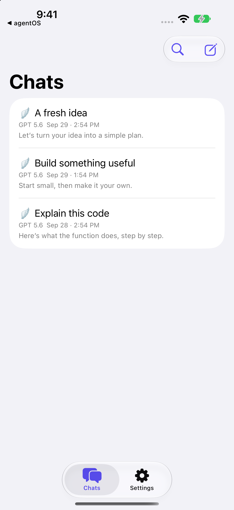
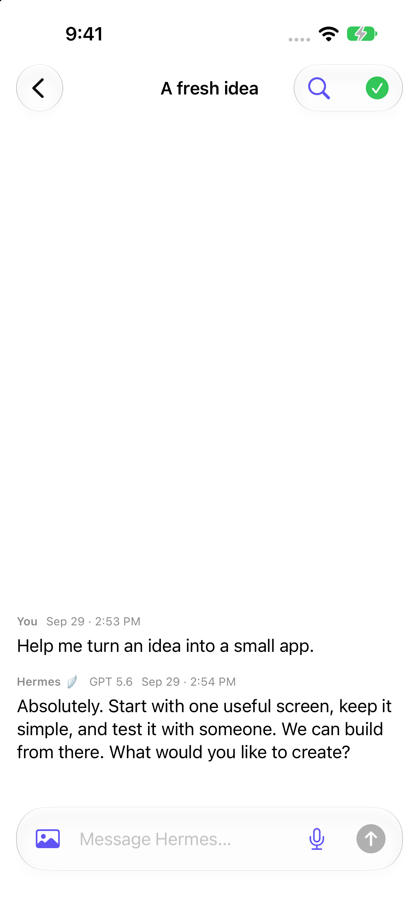
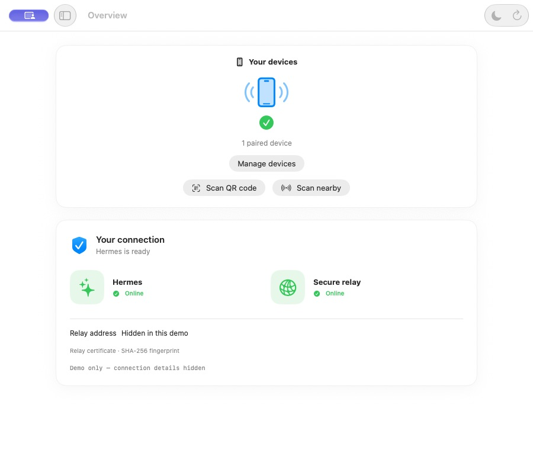

# agentOS

A basic, extensible chat app for an existing [Hermes agent](https://github.com/nousresearch/hermes-agent). agentOS provides a native SwiftUI iPhone/iPad interface and a macOS companion for pairing and connection management. Use it as a starting point, customize it, and build on it for your own projects.

## Screenshots

Screenshots show example conversations and a demo connection.

<p>
  
  
</p>



## Features

- Text and images, streamed replies, selectable Markdown and code, and agent approval prompts.
- Native Chats and Settings navigation with adaptive iPhone and iPad layouts.
- On-device voice transcription and conversation search by text or voice.
- Face ID or Touch ID app protection with the system passcode fallback.
- QR and nearby pairing, certificate-pinned HTTPS, per-device access, and revocation.
- Light, Dark, and Follow System appearance in both apps.
- Conversation timestamps, model labels, swipe deletion, and multi-selection.
- Guided onboarding and a Mac overview for connection health and paired devices.

## Requirements

Hermes must already be installed and configured on your Mac with a working model/provider. agentOS does not install Hermes or include model access.

- **iPhone/iPad:** iOS 17 or newer. Liquid Glass is used on iOS 26 and newer.
- **Mac companion:** macOS 14 or newer. The downloadable installer is for Apple silicon.
- Both devices must share a reachable local network.
- The companion's management helper requires a working `/usr/bin/python3`, provided by Apple developer tools on supported setups.

## Install the Mac companion

Download the installer and checksum from [GitHub Releases](https://github.com/hansimgamr/agentOS/releases). Open the `.pkg`, follow macOS Installer, and launch **agentOS Companion** from `/Applications`.

The current release is a development build. The app is ad-hoc signed; the installer is not Developer ID signed or notarized, so macOS may block a downloaded copy. You can also build from source below. Quit an existing companion before upgrading.

## Connect your iPhone or iPad

1. Install and configure Hermes on your Mac first.
2. Open **agentOS Companion** and choose **Prepare connection** if offered. Confirm Hermes and Secure relay are Online.
3. Choose **Scan QR code** on the Mac and scan it in the iOS app, or choose **Scan nearby** and follow the code-comparison prompts on both devices.
4. Open a chat and send your first message.

Allow Local Network access when prompted. Camera and microphone permissions are requested when their features are used. The companion can be closed after pairing; the relay runs independently.

Use **Manage devices** on the Mac to review or revoke access. **Disconnect** on iOS removes the local pairing; revoke it on the Mac as well when server access should be removed. If the Mac changes networks, prepare the connection and pair again.

## Build from source

### iPhone and iPad

Open `HermesPocket.xcodeproj`, select your own Xcode signing team, and run the `HermesPocket` scheme on a simulator or supported device.

### Mac companion

With full Xcode selected as the active developer directory:

```sh
bash MacCompanion/build.sh
open '/tmp/agentOS Companion.app'
```

To create a macOS installer:

```sh
bash MacCompanion/package.sh 0.1.0
```

The package and SHA-256 checksum are written to `build/`. Each build targets the build machine's architecture; it is not a universal binary. The installer includes the app, management helper source, and license notice. Connection setup runs under your account when requested in the app.

The app uses `com.agentos.app` for its bundle and Keychain service, and `com.agentos.relay` for its relay service. Moving from an earlier identifier requires fresh pairing. Stop the previous relay launch agent before preparing a replacement service.

## Security and privacy

The Mac-only Hermes key stays on the Mac. The phone stores its own device access in Keychain and pins the relay certificate. Dictation uses on-device speech recognition; chat and images may still be sent to the model provider configured in Hermes.

Paired devices can invoke the agent's tools through chat and approval routes. Revoke lost devices and keep the relay on your local network; do not forward its port through your router. See [SECURITY.md](SECURITY.md) for implementation details and operational limits.

## Development checks

```sh
python3 -m unittest discover -s MacRelay -p 'test_*.py'
python3 -m unittest discover -s Tests -p 'test_relay_transport.py'
python3 Tests/run_stream_transport_checks.py
sh Tests/run_pairing_state_checks.sh
```

See [getting started](docs/GETTING_STARTED.md), [pairing](docs/PAIRING.md), [the nearby protocol](docs/NEARBY_PAIRING.md), [chat transport](docs/CHAT_TRANSPORT.md), and [development checks](docs/DEVELOPMENT.md).

## License

[MIT licensed](LICENSE). Use, modify, distribute, sublicense, or sell this software for any purpose, including commercial use, while preserving the copyright and license notice. Attribution is to **agentOS Contributors**. The software is provided without warranty. Hermes and other third-party software retain their own licenses.
